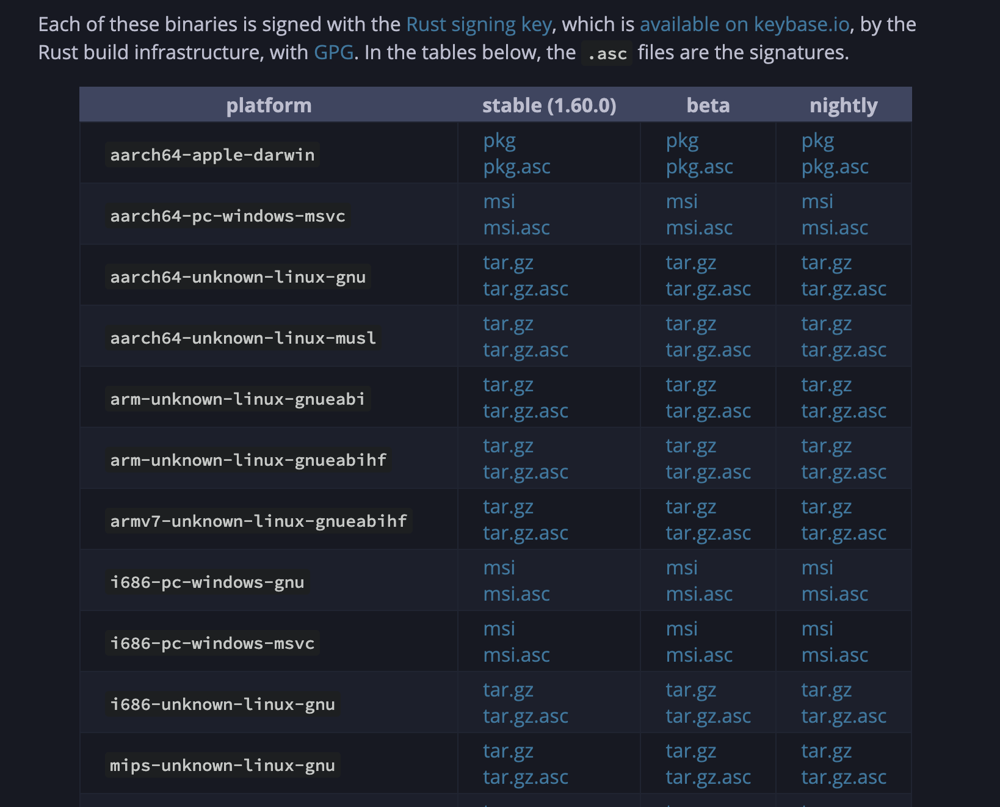

# 安装

Rust 的官方网址是: [https://www.rust-lang.org/](https://www.rust-lang.org/)

## 1. 安装 Rust

### 1.1. 脚本安装方式

使用电脑打开到 Rust 的官方网站之后，Rust 会判断我们当前的操作系统并引导我们进行安装。

Windows 的 Linux子系统、Linux、MacOS 只需执行以下命令，即可根据提示进行安装

```shell
curl --proto '=https' --tlsv1.2 -sSf https://sh.rustup.rs | sh
```

> 推荐使用脚本的方式进行安装，安装脚本会将 Rust 相关组件安装自己的用户目录上，并且设置好相关的环境变量

### 1.1. 二进制安装包安装

Rust 也支持使用二进制文件包的方式的安装方式。

打开其他安装方式的页面：[https://forge.rust-lang.org/infra/other-installation-methods.html](https://forge.rust-lang.org/infra/other-installation-methods.html)，我们找到二进制安装包下载链接的页面位置，如下图所示



> 在编写此文档的时候，Rust的最新稳定版本是`1.60.0`，你在打开的时候，页面可能有所变化。

找到与自己操作系统匹配的安装包，点击下载进行安装即可。

### 1.2. 包管理工具安装

包管理工具可以快速安装Rust，如mac电脑使用homebrew安装，如下命令

```shell
brew install rust
```

### 1.3. 安装验证

安装完成后，使用以下命令查看版本号，如果正常显示rust版本信息代表安装成功，否则重启终端或者检查其他原因

```shell
rustc --version
```

使用脚本方式安装的 Rust 会包含一个 `rustup` 工具，我们还可以使用 `rustup` 的 `doc` 指令通过浏览器打开本地文档，如下

```shell
rustup doc
```

## 2. IDE开发

如果使用 `VsCode` 或者 `Intellij Idea` 进行 `Rust` 代码开发，还可以在插件市场搜索 `Rust`，安装上 `Rust` 的官方插件，可以更好地在 `IDE` 中使用 `Rust` 的相关功能。
