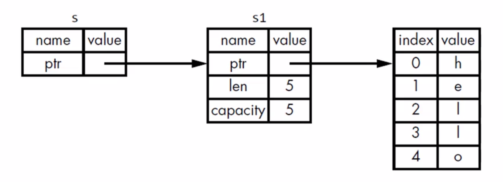

# 引用与借用

## 1. 引用与借用

我们使用引用参数来计算字符串的长度，如下代码

```rust
fn main() {
    let s1 = String::from("hello");

    let len = calculate_length(&s1);

    println!("The length of '{}' is {}.", s1, len);
}

fn calculate_length(s: &String) -> usize {
    s.len()
}
```

在以上代码中，main函数并没有转移s1参数的所有权，而是将s1参数的引用传到计算的函数，在传入参数前面使用`&`符号代表传递一个“引用”。`&s1`代表创建了`s1`的引用，但不拥有`s1`，当`&s1`在计算函数内走出作用域时，它指向的值（s1）并不会在清理掉。

在calculate_length函数里，参数的类型是 &String，而不是 String，`&`符号就标识引用，引用可以做到 引用某些值而不取得其所有权。如下图



在计算函数中，s的作用域与其他参数类似，但它不会在自己离开作用域后销毁其指向的数据，因为它并不拥有该数据的所有权，我们就把以引用作为函数参数的行为叫做“借用”。默认情况下，借用的值不可变。

## 2. 让引用的数据可变

通过前面的文章中我们知道`mut`关键字标识变量可变，同样，我们可以给原变量和引用同时加上`mut`关键字，让引用的数据可变。如下示例代码

```rust
fn main() {
    let mut s1 = String::from("hello");

    let len = calculate_length(&mut s1);

    println!("The length of '{}' is {}.", s1, len);
}

fn calculate_length(s: &mut String) -> usize {
    s.push_str(", world");
    s.len()
}
```

但要注意的是，可变引用有一个重要的限制，在特定的作用域内，对某一块数据，只能有一个可变引用，这样的好处是可在编译时防止数据竞争。如下示例代码将会编译报错

```rust
fn main() {
    let mut s = String::from("hello");
    let s1 = &mut s;
    let s2 = &mut s;
    println!("{},{}", s1, s2);
}
```

在以下三种行为都满足的话可能会发生数据竞争

- 两个或多个指针同时访问同一个数据
- 至少有一个指针用于写入数据
- 没有使用任何机制来同步数据的访问

这种竞争机制在运行时是很难发现的，所以rust做了一个根本的解决，那就是编译的时候就防止 两个指针同时指向一个数据。


我们可以通过创建新的作用域，来允许非同时地创建多个可变的引用，如下示例代码

```rust
fn main() {
    let mut s = String::from("hello");

    {
        let s1 = &mut s;
    }

    let s2 = &mut s;
}
```

以上代码中，s1的作用域结束了之后，即可创建s的新引用赋给 s2。


## 3. 不变引用

不可以同时拥有一个可变引用和一个不可变引用，如下代码将会编译报错

```rust
fn main() {
    let mut s = String::from("hello");
    let r1 = &s;
    let r2 = &s;
    let s1 = &mut s;

    println!("{}, {}, {}", r1, r2, r3);
}

```

但允许多个不变引用同时存在的。

## 4. 悬空引用（Dangling References）

悬空指针（Dangling Pointer）：一个指针引用了内存的某个地址，而这块地址内存可能已经释放并分配给其他人使用了。

在Rust里，编译器可以保证引用永远不是悬空引用，如果我们引用了某些数据，编译器将保证在引用离开作用域之前数据不会离开作用域。我们看以下的一个例子

```rust
fn main() {
    let r = dangling();
}

fn dangling() -> &String {
    let s = String::from("hello");
    &s
}
```

在dangling函数中，我们返回s引用，但实际上，当dangling函数执行完毕后，s变量指向的数据已经被释放，那么`&s`将是一个悬空引用。不过，rust不允许这种情况发生，以上的代码并不会编译通过。

## 5. 总结

在任何给定的时刻，引用 只能满足下列条件之一：

- 一个可变的引用

- 任意数量不可变的引用

另外，引用必须一直有效。
