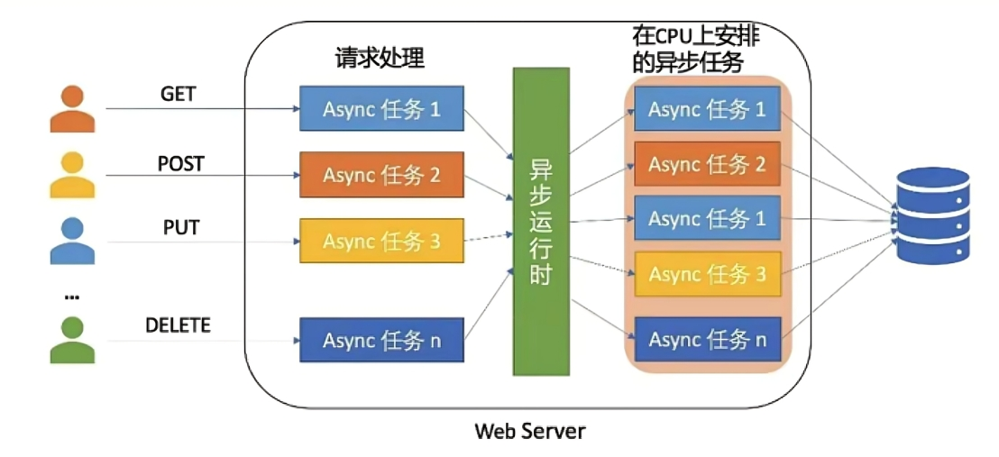

# Rust简易并发实例

## 一、概述

- **并发（concurrency）**：并发是多任务同时运行，但是并不是同时运行，而是交替运行。

- **并行（parallelism）**：并行是多任务同时运行。

在一些情况下，人们会将并发这个词用来代表并发和并行。尤其是在日常语言中或者一般性的讨论中，人们可能会使用并发来表示多个任务同时执行的概念，而不特别区分并发和并行之间的细微差别。因此在这一节中，我们用并发代表 `concurrency` 和 `parallelism`。

在 Rust 中，实现高并发主要通过异步编程模型来处理。本节将介绍为什么需要并发以及 Rust 异步编程的基本概念。

## 二、为什么需要并发？

程序的并发的主要目的是提高系统的性能、资源利用率和响应能力。我们首先需要了解程序处理任务的两种类型：

- CPU密集型：CPU 密集型任务指的是占用 CPU 资源的任务，例如：文件压缩、加密、解密等；
- IO密集型：IO 密集型任务指的是占用 IO 资源的任务，例如：网络传输、文件读取、数据库操作等。

针对不同类型的任务（CPU 密集型和 IO 密集型），需要不同的并发方案来达到最佳性能。对于CPU密集型任务，我们就通常可以利用多CPU或者多核进行处理；针对IO密集型任务，我们通常可以利用多线程进行处理。

## 三、Rust 异步编程的概念

### 3.1 异步与多线程

我们先来了解以下一些概念：


- **同步（synchronous）**：同步是指程序执行到某个任务时，必须等待该任务执行完毕才能继续执行下一个任务。
- **异步（asynchronous）**：异步是指程序执行到某个任务时，不需要等待该任务执行完毕，程序可以继续执行下一个任务。
- **多线程（multithreading）**：多线程是指在单个应用程序中同时执行多个线程，每个线程都可以执行不同的任务。

在 Rust 中，实现并发有多种方式，其中异步编程是一种常用的方式之一。多线程是一种实现并发的另一种方式。

### 3.2 并发的实现方案

#### 3.2.1 多线程的局限性

我们以Web服务器作为示例，Web服务器可以使用多线程来处理多个请求。针对每个请求都开启一个原生的系统线程，虽然了提高性能，却引入了新的复杂性，例如：

- **执行顺序无法预测**: 例如，原本的请求应该顺序应该是 `get`、`post`、`put`、`delete`，但是由于多线程，顺序可能不是这样的，可能 `delete` 先执行完成，导致其他请求处理失败;
- **死锁**: 两个线程彼此等待对方使用完持有的资源，导致线程无法继续;
- **竞态条件（race condition）**: 多个线程同时访问共享资源，导致结果不可预期，例如：多个线程同时修改同一个变量，导致结果不可预期。

其实多线程还存在另外一个问题，在了解这个问题之前，我们先了解一下线程的两种模型：

- **1:1 模型**：每个线程都对应一个原生的系统线程。
- **M:N 模型**: M线程对应 N 个原生的系统线程。这里的 M 线程叫做准线程，或者叫做绿色线程，都指的是语言线程，N 个原生的系统线程叫做操作系统线程。

Rust标准库中就是实现了 1:1 模型。一般来说，操作系统对准线程数是有限制的，它受到栈内存和虚拟内存的影响，而且线程切换的时候还有上下文切换的成本和管理线程的其他资源成本。所以多线程并不是万能的，它不适合所有的需求场景，尤其是在Web服务器中的高并发场景下。

#### 3.2.2 Nginx 的事件驱动并发模型

Nginx 并不是典型的多线程服务器，Nginx 采用了事件驱动的并发模型，使用单线程或少量线程处理并发连接，利用非阻塞 I/O 和事件驱动的方式来提高性能和可伸缩性。下面是一些关键的概念：

- **事件驱动**：Nginx 使用事件驱动的方式来处理并发连接，通过监听事件并在事件发生时触发相应的处理函数来实现高效的并发处理。这种模型避免了传统多线程模型中线程切换的开销，提高了服务器的性能和响应速度。

- **单线程或少量线程**：Nginx 通常使用单线程或少量线程来处理并发连接，每个连接都在一个独立的事件处理函数中处理，避免了线程间的竞争和同步开销，提高了系统的效率和可靠性。

- **非阻塞 I/O**：Nginx 使用非阻塞 I/O 来处理网络请求，当一个 I/O 操作无法立即完成时，Nginx 不会阻塞当前线程，而是继续处理其他请求，等待事件就绪后再进行处理。这种方式避免了线程在等待 I/O 操作完成时的闲置，提高了系统的吞吐量和性能。

#### 3.2.3 Rust 异步编程模型

经过上文的介绍，可以知道多线程并不适合任意的场景，特别是有高并发需求的web服务器。在Rust中，可以使用如下图的方式来实现高并发（图来自互联网）：



每个 HTTP 请求被异步 `Web Server` 接收，`Web Server` 会将请求分发给不同的异步任务，由异步运行时任务安排各个异步任务在可用的 CPU 上执行，最后返回结果。这就是 Rust 的**异步编程模型**。

Rust 的异步编程模型基于 `Future` 和 `Executor`，通过 `async/await` 关键字和 `futures` 库来实现。异步编程允许在单个线程或者多个线程上处理多个并发任务，提高系统的性能和资源利用率。

## 四、编写 Rust 异步程序

### 4.1 同步多任务 - 顺序执行文件读取任务

我们简单模拟两个任务，接下来我们来编写一个简单的同步程序：

```Rust
use std::{thread::sleep, time::Duration};

fn main() {
    println!("Hello, before read file!");
    let file1_content = read_from_file1();
    println!("{:?}", file1_content);

    let file2_content = read_from_file2();
    println!("{:?}", file2_content);
    println!("Hello, after read file2!");
}

fn read_from_file1() -> String {
    sleep(Duration::new(4, 0));
    String::from("Hello, there from file 1")
}

fn read_from_file2() -> String {
    sleep(Duration::new(2, 0));
    String::from("Hello, there from file 2")
}
```

以上程序的执行结果如下：

```bash
Hello, before read file!
"Hello, there from file 1"
"Hello, there from file 2"
Hello, after read file2!
```

在以上程序中，读取文件1花了4秒，读取文件2花了2秒，所以程序执行完之后，输出结果是按照顺序执行的。最终程序执行完成需要6秒。

### 4.2 多线程多任务 - 并发执行文件读取任务

在4.1中存在的问题是程序是同步执行的，即在读取文件1时会阻塞后续代码的执行，直到文件1读取完成才会开始读取文件2。这导致程序的总执行时间等于两个任务中执行时间较长的那个任务的执行时间。在这个例子中，即使文件2的读取任务只需要2秒，但是因为文件1的读取任务需要4秒，所以整个程序的执行时间变成了6秒。

为了解决这个问题，我们可以使用多线程来实现异步执行，如下代码

```Rust
use std::thread;
use std::thread::sleep;
use std::time::Duration;

fn main() {
    println!("Hello, before read file!");
    let handle1 = thread::spawn(move || {
        let file1_content = read_from_file1();
        println!("{:?}", file1_content);
    });

    let handle2 = thread::spawn(move || {
        let file2_content = read_from_file2();
        println!("{:?}", file2_content);
    });

    handle1.join().unwrap();
    handle2.join().unwrap();
}

fn read_from_file1() -> String {
    sleep(Duration::new(4, 0));
    String::from("Hello, there from file 1")
}

fn read_from_file2() -> String {
    sleep(Duration::new(2, 0));
    String::from("Hello, there from file 2")
}
```

以上代码中，使用了 `thread::spawn` 来创建两个线程，分别用于读取文件1和文件2。这样可以同时执行这两个任务，而不是等待第一个任务完成后才开始第二个任务。因此，总的执行时间将大大缩短。最后，调用了 `join` 方法来等待每个线程完成，并获取它们的结果。最终执行结果如下：

```Rust
Hello, before read file!
"Hello, there from file 2"
"Hello, there from file 1"
```

### 4.3 使用Tokio实现异步任务 - 高效执行文件读取任务

最后，我们需要使用 `Tokio` 来实现异步任务。`Tokio` 是一个基于 Rust 的异步运行时，它提供了一套工具和库，使得编写异步程序更加方便。相比于使用裸线程，`Tokio` 提供了更高级的抽象，使得异步编程变得更加简单和高效。实现步骤如下：

首先我们需要执行 `cargo add tokio` 来添加 `tokio` 依赖。然后编写代码如下

```Rust
use std::{thread::sleep, time::Duration};

#[tokio::main]
async fn main() {
    println!("Hello, before read file!");

    let h1 = tokio::spawn(async {
        let _file1_content = read_from_file1().await;
        println!("{:?}", _file1_content);
    });

    let h2 = tokio::spawn(async {
        let _file2_content = read_from_file2().await;
        println!("{:?}", _file2_content);
    });

    let _ = tokio::join!(h1, h2);
}

async fn read_from_file1() -> String {
    sleep(Duration::new(4, 0));
    println!("{:?}", "Processing file 1");
    String::from("Hello, there from file 1")
}

async fn read_from_file2() -> String {
    sleep(Duration::new(2, 0));
    println!("{:?}", "Processing file 2");
    String::from("Hello, there from file 2")
}
```

以上代码使用了 `Tokio` 提供的异步功能来执行文件读取任务。在 main 函数中，我们使用 `tokio::spawn` 创建了两个异步任务，分别用于读取文件1和文件2。这样，这两个任务可以并行执行，而不会相互阻塞。

当我们在异步函数中调用另一个异步函数时，需要使用 `await` 关键字来等待该异步函数的完成。在这个例子中，read_from_file1 和 read_from_file2 都是异步函数，因此在 main 函数中调用它们时，需要在其前面加上 `await` 关键字来等待它们的执行结果。

最后，使用 `tokio::join!` 宏来等待两个异步任务完成。使用 `Tokio` 能够让我们更方便地编写异步程序，而不用关心底层的线程管理和调度。

## 五、总结

通过本文的介绍，我们了解了程序并发以及异步编程的基本概念。在现代计算机系统中，利用的异步编程可以充分利用系统资源，提高程序的性能和响应能力。而 `Tokio` 是一个基于 Rust 的异步运行时，提供了一套工具和库，使得我们编写 Rust 异步程序更加方便。
