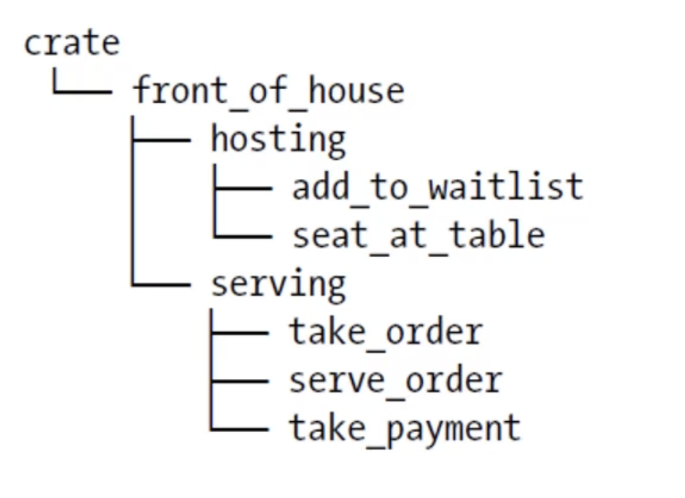

# package、crate、module

## 一、概述

### 1.1 名词

package：包

crate：单元包

module：模块

### 1.2 代码组织

rust的代码组织主要包括以下

- 哪些细节可以暴露，哪些细节是私有的
- 作用域内哪些名称有效

这些功能有时候统称为模块系统，模块系统包含如下内容

- Package（包）：Cargo的特性，让你构建、测试、共享cr、ate
- Crate（共享包）：一个模块树，他可以产生一个library或者可执行文件
- Module（模块）、use：让你控制代码的组织、作用域、私有路径
- Path（路径）：为struct、function或者module等项命名的方式

## 二、package和Crate

### 2.1 Crate的类型

- binary
- library

### 2.2 Crate Root

- 是源代码文件
- Rust编译器是从这里开始，组成你的Crate的根的Module，也就是说它是一个入口文件

### 2.3 Package

- 包含一个`Cargo.toml`，它描述了如何构建这些Crates
- 最多包含1个library crate
- 可以包含任意数量的binary crate
- 必须至少包含一个crate（library或binary）

当我们使用`cargo new`命令创建一个项目时，对应的项目就是一个binary类型的package。

cargo会将`src/main.rs`最为binary crate的根，crate的名与package的名是相同的；如果我们的项目下存在`src/lib.rs`文件，那么该package就是包含一个library crate，该crate是library crate的根，这个crate的名与package的名也是相同的。

cargo会把crate root文件交给rustc来构建library或binary。

### 2.3 cargo的惯例

一个package可以同时包含`src/mian.rs`和`src/lib.rs`，一个 binary crate，一个 library crate，名称与package相同。

一个package可以有多个binary crate，文件放在`src/bin`下，放在该目录下的咩哥文件都是单独的binary crate。

### 2.4 crate的作用

crate将相关的功能组合到一个作用域内，便于在项目间进行共享，防止冲突。例如使用rand crate，访问它的功能需要通过他的名字：rand。

## 三、定义Module

定义module来控制作用域和私有性，Module的作用如下

- 在一个crate内，将代码进行分组
- 增加可读性，易于复用
- 控制项目（item）的访问属性性，public、private

通过`module`关键字来建立module，module是可嵌套的，在子module可包含其他项目（struct、enum、常量、trait、函数等）的定义。如下示例代码

```rust
mod front_of_house {
    mod hosting {
        fn add_to_wailist() {}
        fn seat_at_table() {}
    }

    mod serving {
        fn take_order() {}
        fn serving() {}
        fn take_payment() {}
    }
}
```

以上代码结构如下图所示



`src/main.rs`和`src/lib.rs`叫做crate roots。这两个文件（任意一个）的内容形成了名为`crate`的模块，位于整个模块树的根部。
