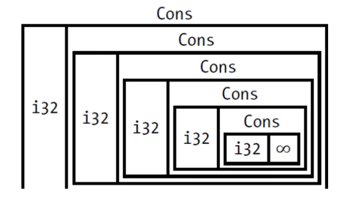
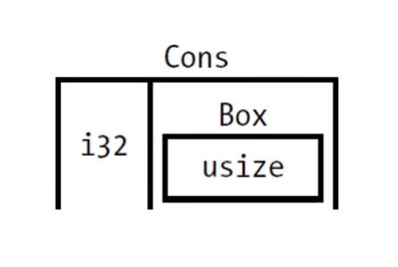

# 使用Box来指向Heap上的数据

## 一、概述

`Box<T>`是一种最简单的智能指针，它实现了Deref trait和Drop trait。它允许你在heap上存储数据（而不是stack），Box在stack上有一个指针，指向heap上的真正数据，如下图

[49-01](./img/49-01.png)

出了把数据存储在heap上之外，`Box<T>`没有其他的性能开销了，同时也没有其他额外的功能，适用于“间接”存储的场景，例如Cons List。

## 二、Box<T>的常用场景

`Box<T>`主要有3个使用场景，如下

- 在编译时，某类型的大小无法确定。但使用该类型时，上下文却需要知道它的确切大小。
- 当你有大量数据，想移交所有权，但确保这些爱操作时数据不会被复制。
- 使用某值时，你只关心是否实现了特定的trait，尔不关心它的具体类型。

## 三、如何在heap上存储数据

我们先来看个示例代码

```rust
fn main() {
    let b = Box::new(5);
    println!("b = {}", b);
}
```

在上面的变量`b`中，如果我们使用其他数据类型，那么数据将存在stack上，而显示用了`Box`的`new`关联函数，5就存在heap上了。和其他任何拥有所有权的值一样，`b`在离开自己作用域的时候，会被自动释放存在statck上面的指针，已经存在heap上的数据。

## 四、使用Box赋能递归类型

### 4.1 递归数据结构

在编译时，Rust需要知道每一个类型所占的空间大小，递归类型的数据结构如下图



而递归类型的大小无法在编译时确定，但在递归类型中使用Box就能解决上诉问题。

Cons List是来自Lisp语言的一种数据结构，Cons List里的每个成员由两个元素组成，一个字段是当前项的值，另外一个字段是下一个元素。而下一个元素的数据类型也是当前元素的数据类型。Cons List 里的最后一个成员只包含一个Nil值，没有下一个元素。

其实Cons List就是其中链表，在Rust语言里面，像Cons List的结构并不是常用的集合。通常情况下，`Vec<T>`是更高的选择。

下面我们尝试在Rust中定义如Cons List 这样的递归数据结构，如下错误的代码

```rust
use crate::List::{Cons, Nil};

enum List {
    Cons(i32, List),
    Nil,
}

fn main() {
    let list = Cons(1, Cons(2, Cons(3, Nil)));
}
```

上面的代码编译之后，将会出现报错，因为上面的`list`是递归的数据类型，拥有是无限制的大小，rust无法计算出存储list需要多大的空间。

### 4.2 解决存储递归数据结构的问题

我们继续看一个枚举的数据结构，分析Rust如何确定枚举分配的空间大小

```rust
enum Message {
    Quit,
    Move { x: i32, y:i32 },
    Write(String),
    ChangeColor(i32, i32, i32),
}
```

rust会🏪枚举的所有变体，而一个枚举值只会有一个变体存在，所以Message枚举所需要的空间大小也就是能够存储得下最大变体的空间大小。

`Box<T>`是一个指针，指针的大小不会因为它指向的数据的大小变化而变化，Rust知道它需要多少空间。所以要在Rust中使用Cons，使用Box间接存储Cons中下一个数据即可，如下数据结构



修改代码如下

```rust
use crate::List::{Cons, Nil};

enum List {
    Cons(i32, Box<List>),
    Nil,
}

fn main() {
    let list = Cons(1, 
        Box::new(Cons(2,
            Box::new(Cons(3,
                Box::new(Nil))))));
}
```

现在使用新的Cons数据结构后，rust便知道使用一部分空间存储i32数据类型，意外一部分空间存储Box（相当于一个指针的大小）。优化之后数据结构仍然是一个递归，而数据不是直接存储了，使用一种间接的方式来指向和存储数据。
