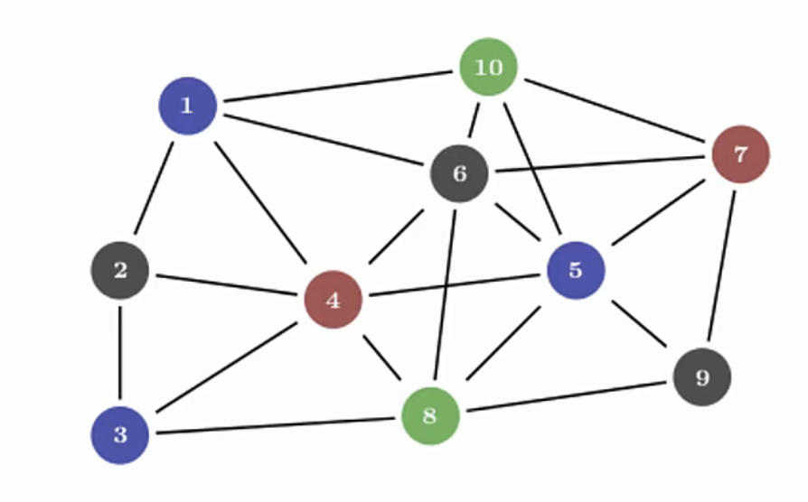
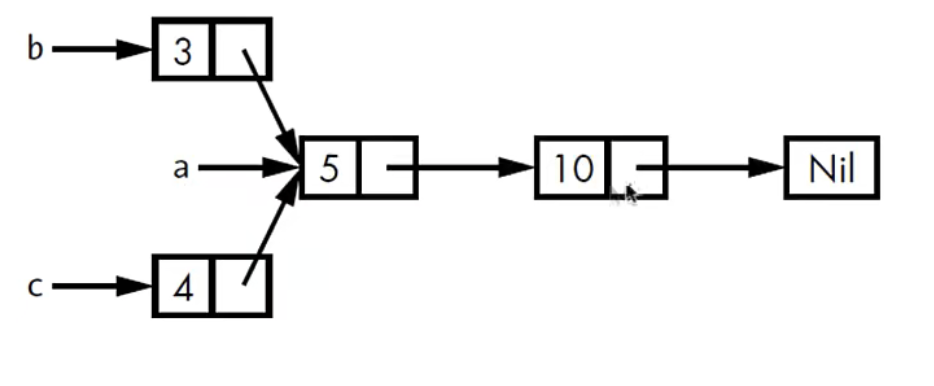

# Rc<T>

## 一、概述

`Rc<T>`是一个引用计数智能指针。

所有权在大多数情况下是比较清晰的，对于一个值，我们一般能准确判定哪个变量拥有它，但在某些场景中，单个值有可能被多个所有者所持有。我们看一个图



图中是一个图的数据结构，节点6被多个数据节电引用，就可以说节点6同时被多个数据拥有。为了支持多重引用，rust提供了一种叫`Rc<T>`的数据类型。即`reference counting`（引用计数）。这个数据类型会在实例的内部维护一个用于记录值的引用次数的计数器。从而判断该值是否仍然在使用，得以追踪到所有值的引用。如果记录到某个值的引用个数为0，那么可以意味该值可以被清理掉，而且不用出发引用失效的问题。

## 二、Rc<T>使用场景

需要在heap上分配数据，这些数据被程序员的多个部分读取（只读），但在编译时无法确定哪个部分最后使用完这些数据，就可以使用`Rc<T>`。需要注意的是，`Rc<T>`只能用于但线程场景。

`Rc<T>`不在域导入模块（prelude）中，`Rc::clone(&a)`函数用于增加引用计数，而`Rc::strong_count(&a)`用于获得引用计数，而`Rc::weak_count`函数用于弱引用计数。下面我们先看一个示例

两个List共享另一个List的所有权，如下图



为了实现上面的功能，我们编写如下代码

```rust
enum List {
    Cons(i32, Box<List>),
    Nil
}

use crate::List:: {Cons, Nil};

fn main() {
    let a = Cons(5,
        Box::new(Cons(10,
           Box::new(Nil))));

    // 开头元素是3，再接上a
    let b = Cons(3, Box::new(a));
    // 开头元素是4，再接上a
    let c = Cons(4, Box::new(a));
}
```

不过以上的代码编译时会发生错误，因为`a`的已经将值移动到了`b`即将所有权转移到了`b`，如果再移动到`c`将会发生报错。如果我门使用`Rc<T>`，将解决该问题，如下示例代码

```rust
use crate::List::{Cons, Nil};
use std::rc::Rc;

enum List {
    Cons(i32, Rc<List>),
    Nil,
}

fn main() {
    let a = Rc::new(Cons(5, Rc::new(Cons(10,Rc::new(Nil)))));
    let b = Cons(3, Rc::clone(&a));
    let c = Cons(3, Rc::clone(&a));
}
```

在上面的代码中，当创建了`b`对`a`的引用时，Rc计数器变成2，当创建`c`对`a`的引用时，Rc计数器变成3，`a`、`b`、`c`这3个应用共享的时一份数据。每次调用`Rc::clone`方法，Rc的计数器都会增加1。`Rc<T>`这种数据类型的引用计数器减少到0的时候，对应的数据才会被清理掉。

其实在上面的示例代码中，如果我想拷贝`a`对应数据，也可以`a.clone()`方法，但是该方法会执行深度拷贝，在heap上创建出另外一份数据。而`Rc::clone`只会进行浅拷贝，在stack上创建数据的引用。我们通常惯例调用`Rc::clone`而不是调用数据类型对应的`clone`方法。

下面我们修改一下`main`函数

```rust
let a = Rc::new(Cons(5, Rc::new(Cons(10, Rc::new(Nil)))));
println!("counter after creating a = {}", Rc::strong_count(&a));

let b = Cons(3, Rc::clone(&a));
println!("counter after creating b = {}", Rc::strong_count(&a));

{
    let c = Cons(3, Rc::clone(&a));
    println!("counter after creating c = {}", Rc::strong_count(&a));
}

println!(
    "counter after c goes out of scopes = {}",
    Rc::strong_count(&a)
);
```

我们使用`Rc::strong_count`函数打印出强引用的计数，运行结果如下

```rust
counter after creating a = 1
counter after creating b = 2
counter after creating c = 3
counter after c goes out of scopes = 2
```

可以看到，当变量离开作用域的时候，计数引用也会自动减少。

## 三、Rc::clone()和类型的clone()方法

`Rc::clone()`: 增加引用，不会执行数据的深度拷贝操作
类型的`clone()`: 大多情况会执行数据的深度拷贝操作

`Rc<T>`通过不可变引用，使得我们可以在程序不同部分之间共享只读数据。但是，在开发中很多时候需要数据可变，如何允许数据变化呢？我们将在后续的章节中介绍。
