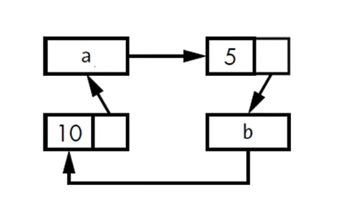

# 循环引用导致内存泄漏

## 一、内存泄漏的示例

rust的内存安全机制可以保证很难发生内存泄漏，但不是不可能。如使用`Rc<T>`和`RefCell<T>`就可能造出循环使用，从而发生内存泄漏。因为每项的引用数量不会变成0，值也不会被处理掉。我们先看下面的示例代码

```rust
use std::{cell::RefCell, rc::Rc};
use crate::List::{Cons, Nil};

#[derive(Debug)]
enum List {
    Cons(i32, RefCell<Rc<List>>),
    Nil,
}

impl List {
    fn tail(&self) -> Option<&RefCell<Rc<List>>> {
        match self {
            Cons(_, item) => Some(item),
            Nil => None
        }
    }
}

fn main() {
    let a = Rc::new(Cons(5, RefCell::new(Rc::new(Nil))));

    // 打印a的强引用
    println!("a initial rc count = {}", Rc::strong_count(&a));
    // 打印a的第二个元素
    println!("a text item = {:?}", a.tail());

    // b的第一个元素是10，第二个元素共享a的数据
    let b = Rc::new(Cons(10, RefCell::new(Rc::clone(&a))));
    // 打印a的强引用
    println!("a rc count after b creation = {}", Rc::strong_count(&a));
    // 打印b的强引用
    println!("b initial rc count = {}", Rc::strong_count(&b));
    // 打印b的第二个元素
    println!("b next item = {:?}", b.tail());

    // 取出a的第二个元素
    if let  Some(link) = a.tail() {
        // 把a原来存储的Nil改为B存储的值
        *link.borrow_mut() = Rc::clone(&b);
    }

    println!("b rc count after changing a = {}", Rc::strong_count(&b));
    println!("a rc count after changing a = {}", Rc::strong_count(&a));
}
```

该开始创建a的时候，它的引用数量是1，它的第二个元素是2，b创建之后，a的强引用个数变成2，b的引用个数变成1，b的第二个元素是a。接下来让a的第二个元素指向b，所以这个时候b有两个引用，a也有两个引用，相当于此时创建了一个循环的数据结构，如下图



a的第一个元素是5，第二个元素是b，b的第一个元素是10，第二个元素是a。这时候形成了一个循环。假如此时代码执行完毕，将先释放b，因为b是在后面创建的。程序将会把b对应的数据的引用计数减少到1，因为此时a仍然存在一个指向b对应的数据的引用。那么b对应的List在堆内存上讲不会进行释放，如果我们在`main`函数的最后添加以下一行代码，将会导致堆栈溢出

```rust
println("a next item = {:?}", a.tail());
```

a的第二个元素是b，而的第二个元素是a，以此循环，最终导致堆栈溢出。所以，在rust里，内存溢出并不容易，但绝非不可能。

## 二、防止内存泄漏的解决办法

### 2.1 依靠开发者来保证，不能依靠rust

如认证检查自己的代码逻辑，并做一些测试，防止内存泄漏

### 2.2 重组数据结构

简单来说把引用拆分来持有所有权和不持有所有权两种情况，如在循环引用中，让某些指向关系具有所有权，而另外一部分的指向关系不涉及所有权。这样只有持有所有权的关系才影响值的清理。

### 2.3 防止循环引用，把Rc<T>换成Weak<T>

`Rc::clone`为`Rc<T>`示例的strong_count加1，`Rc<T>`的实例只有在strong_count为0的时候才会被清理。

`Rc<T>`实例通过调用`Rc::downgrade`方法可以创建值的`Weak Reference`（弱引用），返回值类型是`Weak<T>`（只能指针）。每次调用`Rc::downgrade`方法会为`weak_count`（即弱引用计数）加1，而`Rc<T>`使用`weak_count`来追踪存在多少`Weak<T>`，`weak_count`不为0并不影响`Rc<T>`实例的清理。

### 2.4 Strong VS Weak

- Strong Reference（强引用）是关于如何分享`Rc<T>`实例的所有权
- Weak Reference（弱引用）并不表述上述意思

使用`Weak Reference`并不会创建循环引用，因为当`Strong Reference`数量为0的时候，`Weak Reference`会自动断开。在使用`Weak<T>`前，需保证它指向的值仍然存在，在`Weak<T>`实例上调用`upgrade`方法，返回`Option<Rc<T>>`。

### 2.5 Weak Reference使用示例

我们先看以下的示例

```rust
05.48
```
